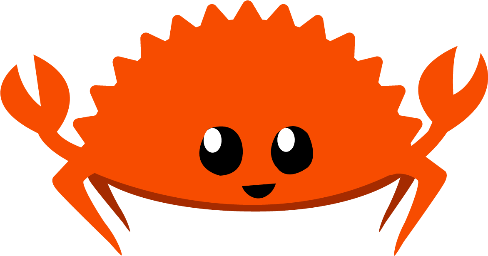

  

# 🦀 Learning Rust

In this repository you will find a Monorepo built with Cargo Workspaces that contains various packages that I built for learning purposes. If you find this repository of any use, please, share it with the community and don't forget to ⭐ it!

# 📦 List of packages

The following list of packages is sorted by creation date and difficulty as I was progressing through the Rust learning curve.

1. [guess-number](https://github.com/alexvcasillas/learning-rust/tree/main/guess-number): Learning the basics of rust with a simple input/output learn the number game. 1
2. [functions](https://github.com/alexvcasillas/learning-rust/tree/main/functions): Lerning the basics of functions in rust and the mathematical operators. Also learned about the `Result` type to handle expected errors in the code. 1
2. [array-and-tuple](https://github.com/alexvcasillas/learning-rust/tree/main/array-and-tuple): Learning the basics of arrays and tuple types in rust. Also learned that in rust a `loop` can return a value to be assigned in a function. 1

Made with 💚 by Alex Casillas!

---

1: It uses the `colorize` cargo library to prettify the console logs.